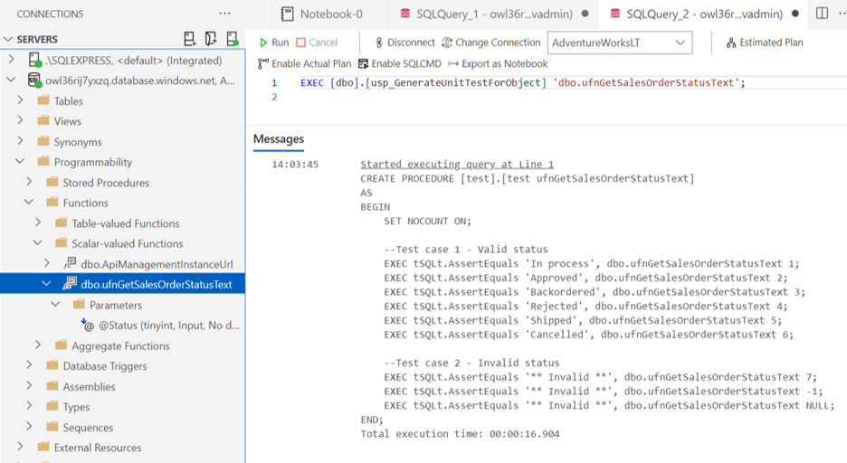

# Step-by-Step Guide to Deploying TSqlChatGPT

> ChatGPT integration relies on `sp_invoke_external_rest_endpoint` which is currently only available for Azure SQL Database (Public Preview)

> **Note**
> Expected costs for running this demonstration are around $2.30/day:
> - Azure SQL Database (Standard S0): ~ $20/month
> - Azure API Management (Developer SKU): ~ $50/month


## Pre-requisites

- If you haven't done so already, you will need to sign up for a free OpenAI account in order to generate the required API key: https://platform.openai.com/signup.  Once registered, select "View API Keys" from the Account menu and create a new secret key.  Keep a copy somewhere safe (don't share) - you will need to use this in the provided SQL script.
- You will also need an Azure SQL Database to run the SQL script and to test the ChatGPT integration.  If you don't already have an existing Azure SQL DB or you wish to create a sample Database for this exercise, then follow the optional step below and click on the "Deploy to Azure" button.

### OPTIONAL: Deploy the AdventureWorksLT Sample Database
Click on the button below to deploy a new Azure SQL database using the AdventureWorksLT sample data.

[](https://portal.azure.com/#create/Microsoft.Template/uri/https%3A%2F%2Fraw.githubusercontent.com%2Fhappyadam73%2Ftsql-chatgpt%2Fmain%2Fazuresqldb%2Fazuredeploy.json)


## 1. Setup the Azure API Management Service and OpenAI API

> The `sp_invoke_external_rest_endpoint` can only make calls to certain safe-listed Azure Services.  In order to call the OpenAI APIs, we need to create a wrapper API within an Azure API Management Instance.

To deploy a new Azure API Management Instance with an OpenAI API, click on the button below.

[](https://portal.azure.com/#create/Microsoft.Template/uri/https%3A%2F%2Fraw.githubusercontent.com%2Fhappyadam73%2Ftsql-chatgpt%2Fmain%2Fapim%2Fazuredeploy.json)

Make a note of the name of the Azure API Management Service - this will need to be copied into the SQL script described below and is the basis for both the Database Credentials object and any API URL endpoints.

**Note:** The API Management Service can take up to an hour to provision.

## 2. Get the API Management API Subscription Key

Once the API Management Service deployment has completed, navigate to the API Management resource and click on the Subscriptions menu option.

The deployment has created a subscription key for the OpenAI API - click on the three dots to the right of this subscription and click on Show/Hide keys as shown below.  

Make a note of this subscription key somewhere safe (do not share) - you will need to add this to the SQL script.


## 3. Run the TSqlChatGPT SQL Script

> Use either [SQL Management Studio](https://learn.microsoft.com/en-us/sql/ssms/download-sql-server-management-studio-ssms) or [Azure Data Studio](https://learn.microsoft.com/en-us/sql/azure-data-studio/download-azure-data-studio) to run the ChatGPT SQL commands - most responses will be displayed in the Messages tab and this may not work correctly in other client applications (such as the Query Preview feature in the Azure Portal)

Open SSMS or Azure Data Studio and connect to your Azure SQL Database - either download and open the TSqlChatGPT.sql file (from the sql folder) or copy the contents to a new query window.

At the top of the script, replace the following:

- Paste your OpenAI API Key in the `@openai_api_key` variable
- Paste your API Management Subscription Key in the `@apim_subscription_key` variable
- Paste the name of your API Management Service in the `@apim_url` variable

The SQL Script should look similar to the screenshot below - once you've pasted in the correct keys, run the script.


## 4. How to use TSqlChatGPT

Currently there are 5 stored procedures to try:
- `dbo.usp_AskChatGPT` - send any message to ChatGPT and get a response (remember ChatGPT does not have any context with regards to your database objects)
- `dbo.usp_ExplainObject` - sends the object definition of any function/procedure/view and returns an explanation of the code (or view)
- `dbo.usp_GenerateTestDataForTable` - sends ChatGPT a CREATE table script based on the table you specify, and asks for an INSERT statement to be generated with test data records
- `dbo.usp_GenerateUnitTestForObject` - sends the object definition of any function/procedure/view and generates a tSQLt Unit Test Stored Procedure for testing the object
- `dbo.usp_DescribeTableColumns` - sends ChatGPT a CREATE table script based on the table you specify, and asks for a description of each column

> **Warning**
> It is recommended to avoid use of these procedures on production systems, or any database containing sensitive or private data.  In the case of the last 4 procedures, the definition of your tables or code for your objects is sent to the OpenAI API (via your API Management Instance).  Only Code and table schemas are sent to ChatGPT - no data is ever sent to ChatGPT.

## Examples with sample outputs
The following are some simple examples you can try with TSqlChatGPT.  It can useful sometimes to ask for a T-SQL script to avoid statements that aren't supported by SQL Server.

### `dbo.usp_AskChatGPT` Examples
```sql
EXEC [dbo].[usp_AskChatGPT] 'Generate a CREATE TABLE script for Customer data';

EXEC [dbo].[usp_AskChatGPT] 'Generate a SQL function to calculate how many days until a specified date';

EXEC [dbo].[usp_AskChatGPT] 'Explain this code: SELECT DATEDIFF(DAY,GETDATE(),DATEFROMPARTS(2023,12,25))';
```


### `dbo.usp_ExplainObject` Examples
```sql
EXEC [dbo].[usp_ExplainObject] 'dbo.uspLogError';

EXEC [dbo].[usp_ExplainObject] '[SalesLT].[vProductAndDescription]';
```


### `dbo.usp_GenerateTestDataForTable` Examples
```sql
EXEC [dbo].[usp_GenerateTestDataForTable] 'SalesLT.ProductCategory';

EXEC [dbo].[usp_GenerateTestDataForTable] '[SalesLT].[Address]';
```


### `dbo.usp_GenerateUnitTestForObject` Examples
```sql
EXEC [dbo].[usp_GenerateUnitTestForObject] 'dbo.uspLogError';

EXEC [dbo].[usp_GenerateUnitTestForObject] 'dbo.ufnGetSalesOrderStatusText';
```



### `dbo.usp_DescribeTableColumns` Examples
```sql
EXEC [dbo].[usp_DescribeTableColumns] 'SalesLT.SalesOrderDetail';

EXEC [dbo].[usp_DescribeTableColumns] '[SalesLT].[Address]';
```


### `dbo.usp_ExplainAllStoredProcsInDB` Examples
```sql
EXEC [dbo].[usp_ExplainAllStoredProcsInDB] 1; -- Replace all stored procs with explaine dversions
EXEC [dbo].[usp_ExplainAllStoredProcsInDB] 0; -- Get all stored procedures and present samples of explain for each
```

## Is TSqlChatGPT self-aware?  
Not really, but it can explain itself!  
Try the following and see what you get:

```sql
EXEC [dbo].[usp_ExplainObject] '[dbo].[usp_AskChatGPT]';
```

Hopefully, it looks something like below:


